
<h1 align="center">基于web的马病管理系统设计与实现+jsp</h1>

## 简介
马病管理系统：角色分为管理员、用户；公告信息管理、马病管理、员工管理、用户论坛留言、马病数据管理和查询。使用SSM框架和JSP技术，界面简洁，功能完备，便于高效管理和操作。    --计算机毕业设计源码；毕设源码；java毕业设计源码

## 联系方式

<h3 align="center">获取完整代码与数据库文件 + 微信：deepguan QQ: 86050149 QQ群: 783742310</h3>

<h3 align="center">可帮忙远程部署 包运行成功！提供远程部署、修改代码、设计文档指导、代码讲解等服务！</h3>

## 功能介绍（完整见运行截图）
管理员：负责管理系统的所有功能模块，包括主页轮播图管理、通知与公告信息的创建与管理、用户与员工账户的管理、马病信息的审核与管理、系统留言的查看与回复等。管理员可以查看和编辑系统中的所有数据，并执行用户账户的审核与密码重置操作。还可以通过公告信息管理模块发布系统更新或重要通知，及根据不同条件筛选和管理马病信息。管理员在个人中心能够更新自身信息并管理员工列表，确保系统操作的安全和高效。

用户：用户可通过马病管理系统页面访问相关知识，与其他用户在论坛进行互动，浏览和发布评论。用户可在个人中心查看和编辑自己的详细资料，涵盖用户名、联系方式、头像等基础信息。系统为用户提供了输入框用于搜索特定马病信息，并可根据诊断需求查看相关病因、症状及预防措施。用户在系统公告中可接收到最新的公告与通知，确保及时了解系统动态及重要信息发布。

## 运行截图
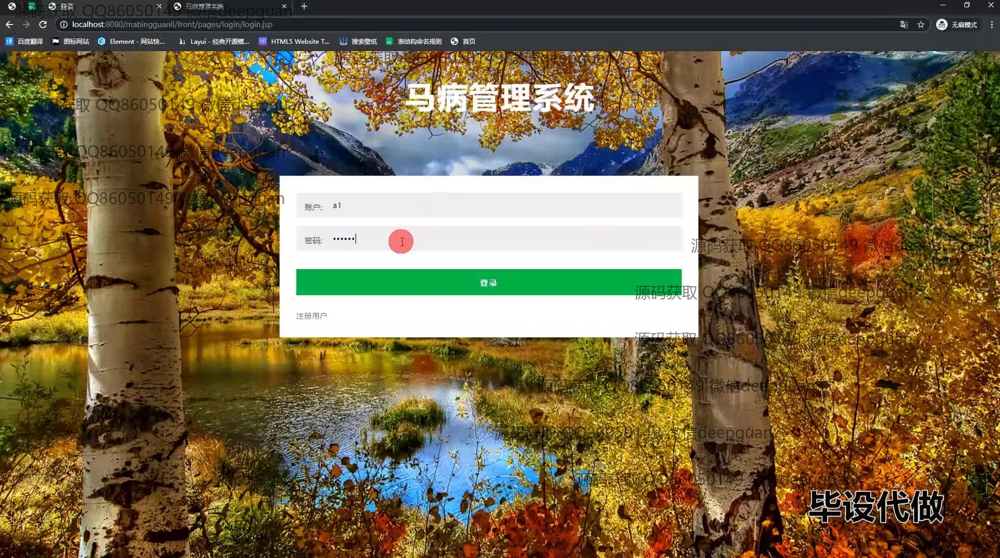

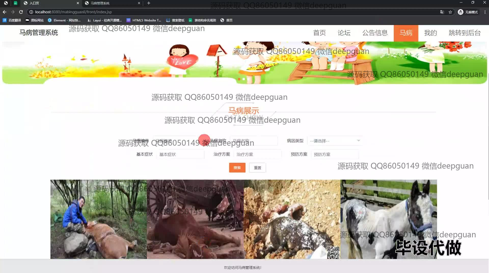
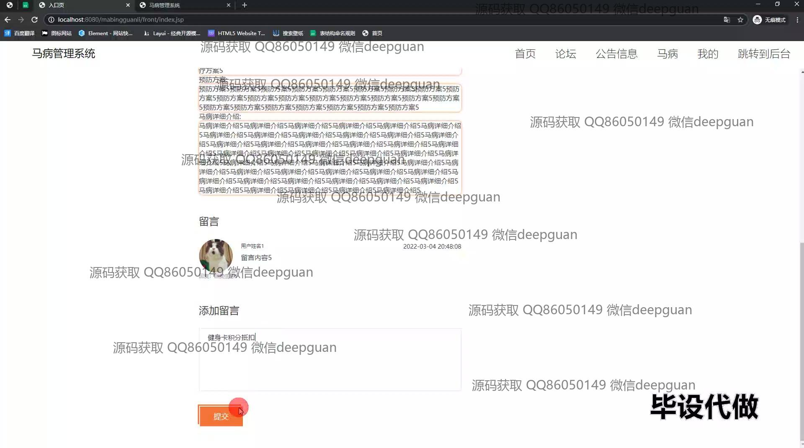
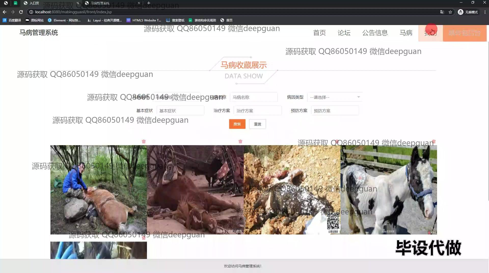
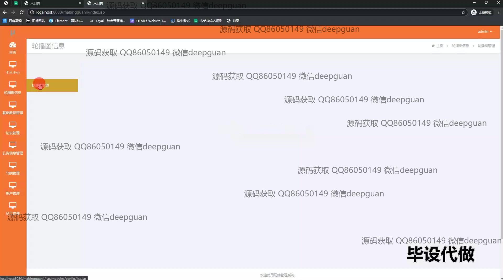
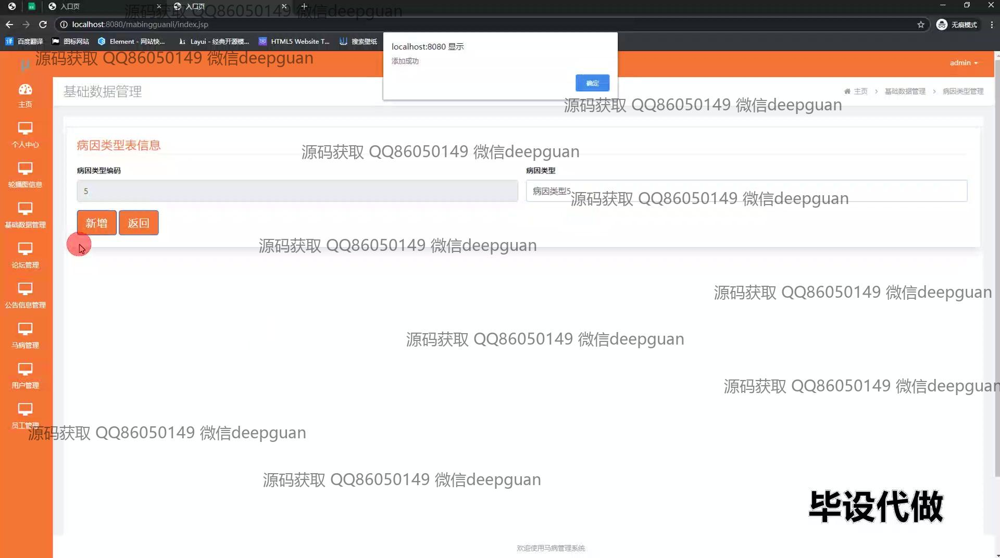
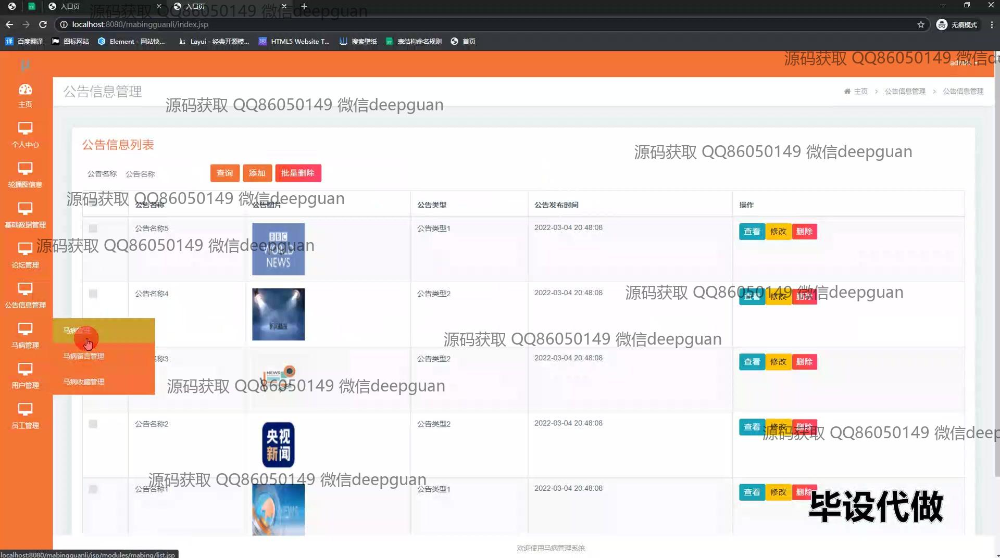
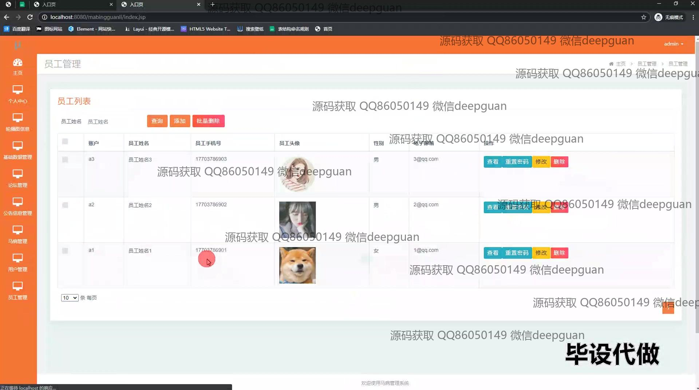
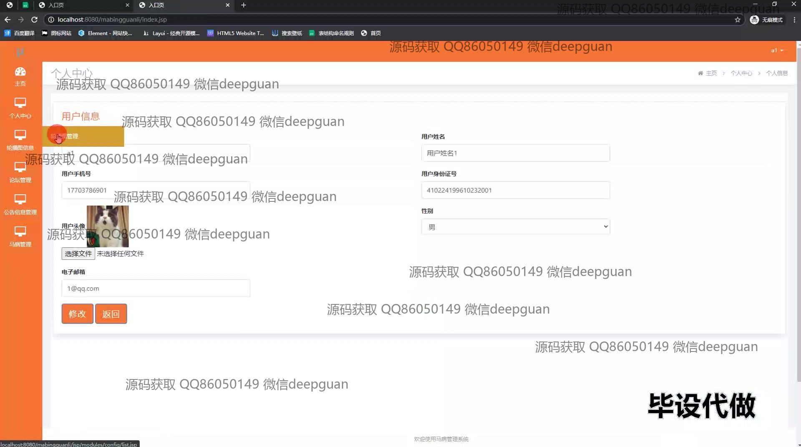
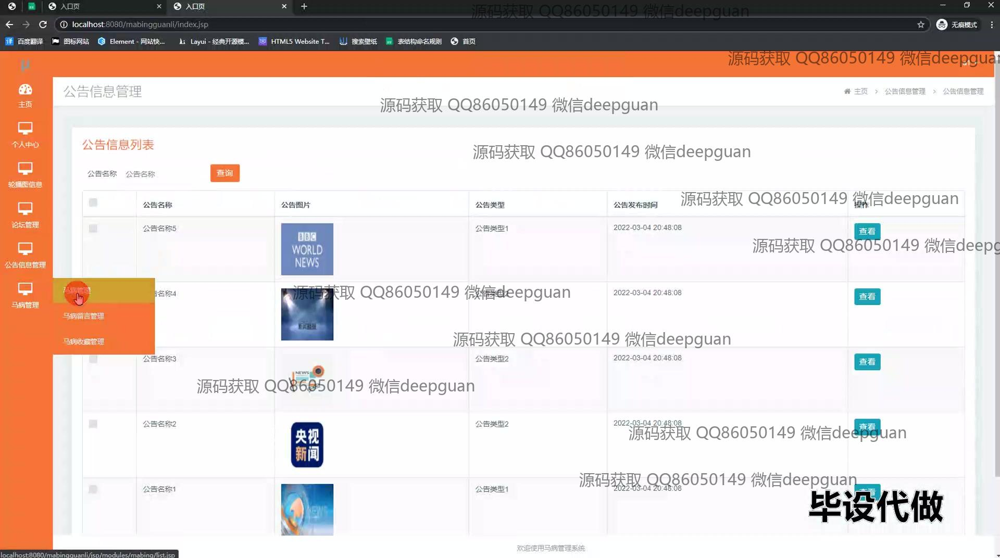
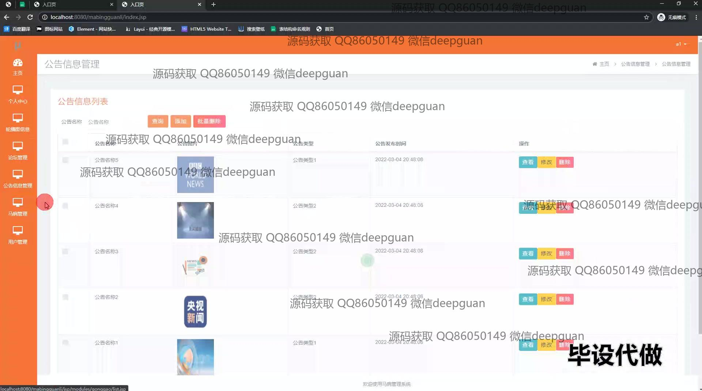
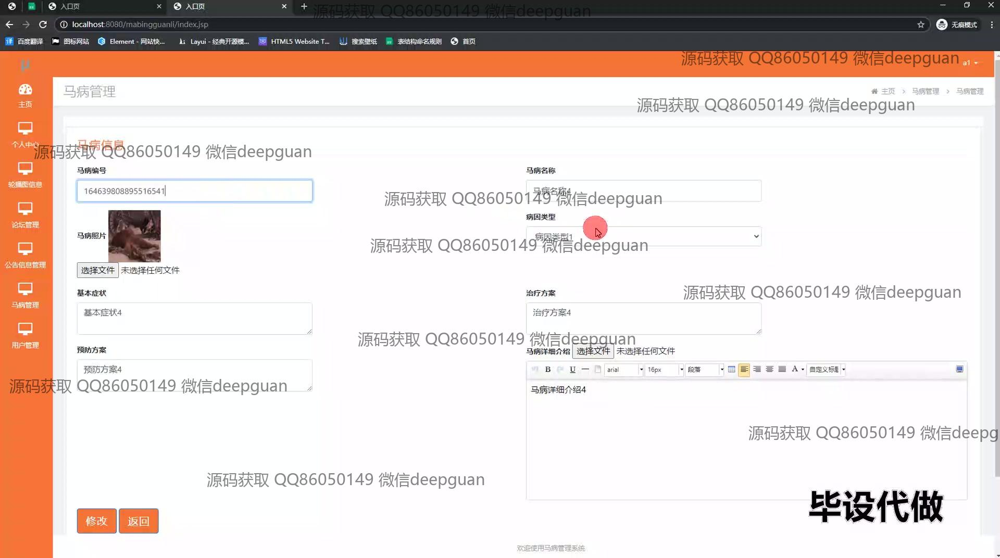
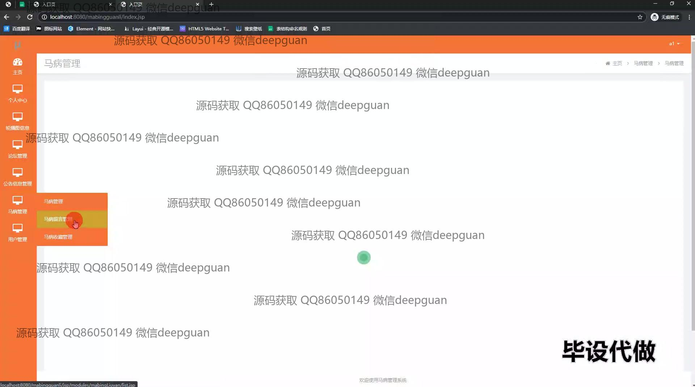
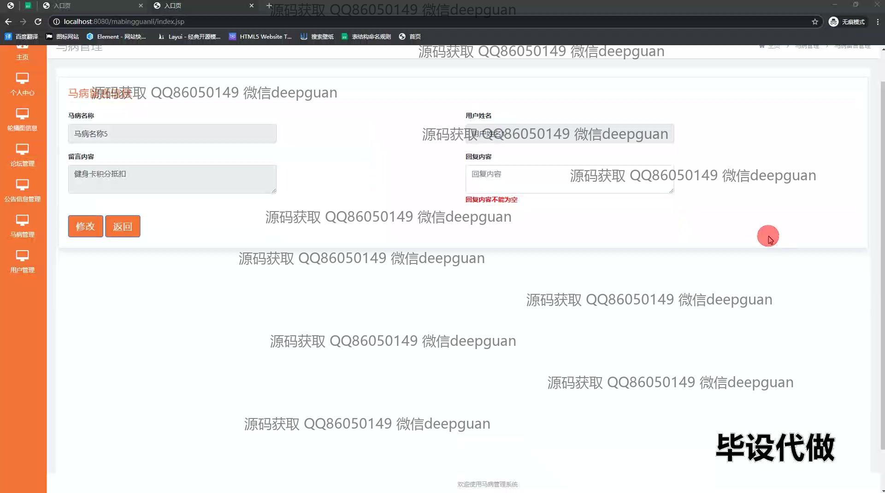
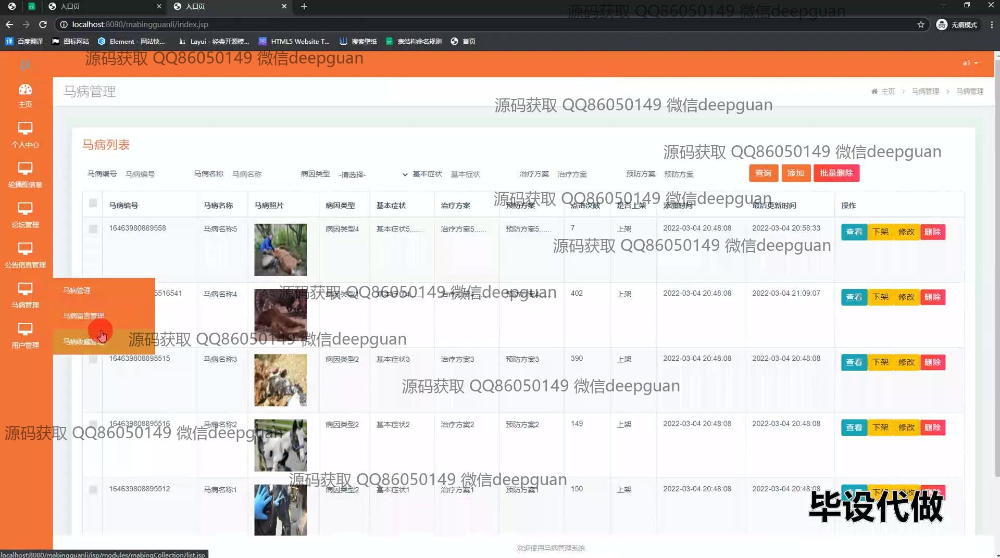

本代码来源于网络,仅供学习参考使用!

